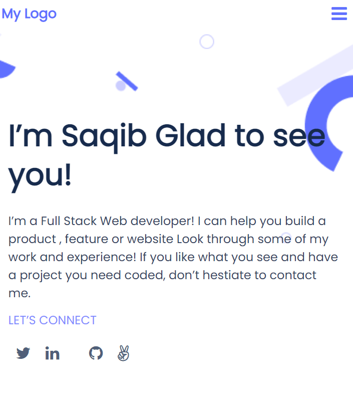

# Setup Portfolio : Mobile version skeleton

> Set up "Mobile version skeleton" project. Learning Objectives are:
> - Understand how to parse a Figma design to create a UI.
> - Usage of flexbox in the page.
> - Use of images and backgrounds to enhance the look of the website..

## Project Preview 

## Built With

- HTML
- CSS
- Github

## Authors

👤 **Saqib Javaid**

- GitHub: [@saqibjavaiddev](https://github.com/saqibjavaiddev)
- Twitter: [@twitterhandle](https://twitter.com/saqibpaf)
- LinkedIn: [LinkedIn](https://linkedin.com/in/saqibjavaid082)

## Show your support

Give a ⭐️ if you like this project!

## 🤝 Contributing

Contributions, issues, and feature requests are welcome!

## Acknowledgments

- Hat tip to anyone whose code was used 🔰
- Inspiration 💘
- Microverse program ⚡
- My standup team 🏹
- My family's support 🙌

## 📝 License

This project is [MIT](./MIT.md) licensed.
